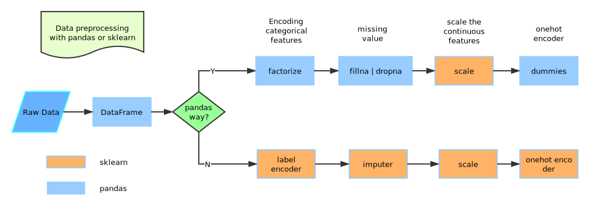

One of the most important thing to use machine(/deep) learning algorithms is data preprocessing (at least I think so -.-)

With python, we can have a take-home way to simple and useful data preprocessing. See the below pic for a quick glance.



Here we use [`sklearn`](http://scikit-learn.org/) and [`pandas`](http://pandas.pydata.org/pandas-docs/stable/) to do the job. To show with a real world example, we use [`UCI adult database`](http://archive.ics.uci.edu/ml/datasets/Adult) to show the usage.

## 1.Download the database

we can use `wget` or just any way to download the database. As for this database, please download all files include, since apart from the `adult.data` and `adult.test`, the other files includes the info of the dataset, and we will use them below.

## 2.Load data to pandas dataframe

The original data format is Ok, but not so appealing, since we have no idea each column is which feature. And dataframe is a nice data format with feature names in the first line.

And the original dataset have split the dataset into two files, one for training, the other for test. Seems nice, but in fact, maybe we should combine them together and split after preprocessing. We will cover it below.

`cat adult.data adult.test > adult.all` is enough, but please delete the first line `|1x3 Cross validator` before combine them together.

Load data into dataframe is just read from file:

``` python
def loadFromFileWithPandas(fileName, feature_names):
    df = pd.read_csv(fileName, names=feature_names, sep=',\s*')  # use a sep with blank so that we can make sure every item do not have blank before or after
    import numpy as np
    df = df.replace(r'\?', np.nan, regex=True)  # replace the `?` as NaN, to better deal missing values

    df_less = df.dropna() # drop Nan

    print(df.shape, df_less.shape, df.shape[0] - df_less.shape[0])
    return df, df_less
```

We should note that `feature_names` is not provided in the data file(s), ``old.adult.names` have the `7. Attribute Information:` (adult.names` have similar info), we can use code to get them(or just copy and paste):

`['age', 'workclass', 'fnlwgt', 'education', 'education-num', 'marital-status', 'occupation', 'relationship', 'race', 'sex', 'capital-gain', 'capital-loss', 'hours-per-week', 'native-country']`, there are 14 features.

In the code above, when `read_csv`, since our data file is separated with `, `(with a blank), so use `sep=',\s*'` when read file.

And `?` in the file represents for No value, in the python computation world, `np.nan` is for that use.

The `dropna` will drop raws(samples) with `NaN`, and the results is nicer dataset (with no missing value), but when deal with real world data, we cannot always just depend on drop the missing value.

Save the results to files:

``` python
data_file = 'adult/adult.all'
df, df_noNaN = loadFromFileWithPandas(data_file, feature_names)
df.to_csv(data_file + '.NaN')
df_noNaN.to_csv(data_file + '.noNaN')
```

We got `(48842, 15) (45222, 15) 3620` in the console, which says that, all dataset is 48842 samples with 3620 have `NaN`, which is 7.412%, so just drop them just need better reasons.